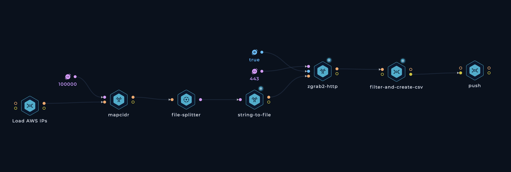

<h1 align="center">Cloud </h1>
<h3 align="center">Monitoring the Cloud Landscape</h3>

Our mission with this project is to provide an always up-to-date and freely accessible map of the cloud landscape for every major cloud service provider.

We've decided to kick things off with collecting SSL certificate data of AWS EC2 machines, considering the value of this data to security researchers. However, we plan to expand the project to include more data and providers in the near future. Your input and suggestions are incredibly valuable to us, so please don't hesitate to reach out on [Twitter](https://twitter.com/trick3st) or [Discord](https://discord.gg/7HZmFYTGcQ) and let us know what areas you think we should prioritize next!

## How can SSL certificate data benefit you?
The [SSL data](./ssl/) is organized into CSV files, with the following properties collected for every found certificate:
- IP Address
- Common Name
- Organization
- Country
- Locality
- Province
- Subject Alternative DNS Name
- Subject Alternative IP address
- Self-signed (boolean)

| IP Address | Common Name | Organization   | Country | Locality       | Province   | Subject Alternative DNS Name | Subject Alternative IP address | Self-signed |
|------------|-------------|----------------|---------|----------------|------------|------------------------------|--------------------------------|-------------|
| 1.2.3.4    | example.com | Example, Inc.  | US      | San Francisco  | California | example.com                  | 1.2.3.4                        | false      |
| 5.6.7.8    | acme.net    | Acme, Inc.     | US      | Seattle        | Washington | *.acme.net                   | 5.6.7.8                        | false      |

So what can you do with this data?
### Enumerate subdomains of your target domains
Search for your target's domain names (e.g. `example.com`) and find hits in the `Common Name` and `Subject Alternative Name` fields of the collected certificates. All IP ranges are scanned daily and the dataset gets updated accordingly so you are very likley to find ephemeral hosts before they are taken down.

### Enumerate domains of your target companies
Search for your target's company name (e.g. `Example, Inc.`), find hits in the `Organization` field, and explore the associated `Common Name` and `Subject Alternative Name` fields. The results will probably include subdomains of the domains you're familiar with and if you're in luck you might find new root domains expanding the scope.

### Enumerate possible sub-subdomain enumeration target
If the certificate is issued for a wildcard (e.g. `*.foo.example.com`), chances are there are other subdomains you can find by brute-forcing there. And you know [how effective of this technique](https://twitter.com/trick3st/status/1614974813889794052) can be. Here are some [wordlists](https://github.com/trickest/wordlists/tree/main/inventory/levels) to help you with that!

💡 Note: Remeber to monitor the dataset for daily updates to get notified whenever a new asset comes up!

### Perform IP lookups
Search for an IP address (e.g. `3.122.37.147`) to find host names associated with it, and explore the `Common Name`, `Subject Alternative Name`, and `Organization` fields to gain find more information about that address.

### Discover origin IP addresses to bypass proxy services
When a website is hidden behind security proxy services like Cloudflare, Akamai, Incapsula, and others, it is possible to search for the host name (e.g., `example.com`) in the dataset. This search may uncover the origin IP address, allowing you to bypass the proxy. We've discussed a similar technique on our blog which you can find [here](https://trickest.com/blog/cloudflare-bypass-discover-ip-addresses-aws/)!

### Get a fresh dataset of live web servers
Each IP address in the dataset corresponds to an HTTPS server running on port 443. You can use this data for large-scale research without needing to spend time collecting it yourself.

### Whatever else you can think of
If you use this data for a cool project or research, we would love to hear about it!

Additionally, below you will find a detailed explanation of our data collection process and how you can implement the same technique to gather information from your own IP ranges.

## How it works

### TB; DZ (Too big; didn't zoom):

1. We kick off the workflow with a simple bash script that retrieves AWS's [IP ranges](https://ip-ranges.amazonaws.com/ip-ranges.json). Using a JQ query, we extract the IP ranges of EC2 machines by filtering for `.prefixes[] | select(.service=="EC2") | .ip_prefix`. Other services are excluded from this workflow since they don't support custom SSL certificates, making their data irrelevant for our dataset.
2. Then, we use [mapcidr](https://github.com/projectdiscovery/mapcidr) to divide the IP ranges obtained in step 1 into smaller ranges, each containing up to 100k hosts (Thanks, [ProjectDiscovery](https://github.com/projectdiscovery) team!). This step will be handy in the next step when we run the parallel scanning process.
3. At the time of writing, the EC2 IP ranges include over 57 million IP addresses, so scanning them all on a single machine would be impractical, which is where our `file-splitter` node comes into play. This node iterates through the input from `mapcidr` and triggers individual jobs for each range. When executing this workflow across multiple machines (let's say 30), they concurrently process these jobs in parallel, significantly reducing the overall runtime. This efficiency enables us to run the workflow on a daily basis, keeping the data constantly updated.
4. The parallel machines then spin up [zgrab2](https://github.com/zmap/zgrab2) instances to collect the SSL certificates. After experimenting with various tools and techniques, `zgrab2`'s tls module emerged as the fastest and most reliable option. Shout out to [The ZMap Project](https://github.com/zmap) team!
5. Each zgrab2 instance passes its data to a bash script that extracts the relevant data and writes its output to CSV files.
6. Finally, we collect and split all the CSV files into manageable 450 KB chunks to get GitHub to [render the CSV files](https://docs.github.com/en/repositories/working-with-files/using-files/working-with-non-code-files). These chunks are then pushed to this repository.

## Contribution
All contributions/ideas/suggestions are welcome! Feel free to create a new ticket via [GitHub issues](https://github.com/trickest/cloud/issues), tweet at us [@trick3st](https://twitter.com/trick3st), or join the conversation on [Discord](https://discord.gg/7HZmFYTGcQ).

## Build your own workflows
We believe in the value of tinkering; cookie-cutter solutions rarely cut it. Sign up for a [Trickest](https://trickest.com) demo to customize this workflow to your use case, get access to many more workflows, or build your own workflows from scratch!

